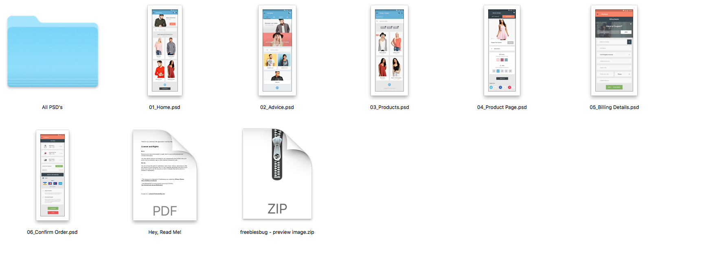
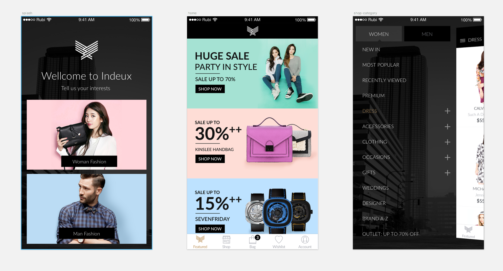
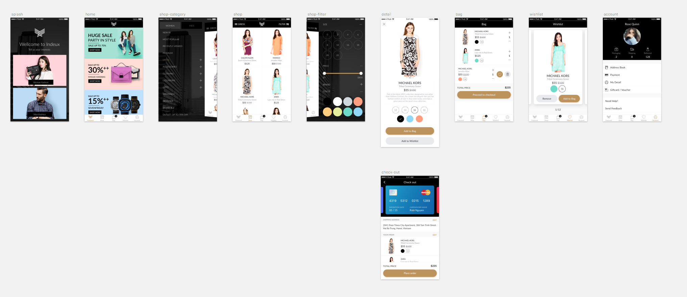

# Prototype Training

Software & Resources 

[Sign-up for Invision App Link](http://www.invisionapp.com/education-signup) 

[Sign up for Marvel App Link] (https://marvelapp.com/)

[Get Marvel App for iOS & Android](https://marvelapp.com/apps/)

[Get invision app for iOS & Android](https://www.invisionapp.com/tour/iphone-ipad-prototyping)

##Fashion e-commerce App - Clickable Prototype
Create a clickable prototype using the assets by [Alfonso Severo](https://dribbble.com/shots/2051093-eCommerce-Concept-12-App-Screen) below:

[Download - eCommerce Concept: 12 Screen App](https://github.com/martinsolent/proto_training/blob/master/downloads/Materia%20-%20eCommerce%20App.zip)

The contents of the ZIP download are Photoshop files file (not Sketch App). They will need to be opened, amended and then save as JPEGs or PNG before uploading to Invision App or Marvel App

## Indeux Fashion Store
OR use this one [Indeux Fashion Store (Sketch App)] (https://www.sketchappsources.com/free-source/2112-indeux-fashion-store-sketch-freebie-resource.html)

### Sketch App File Screens:

### Sketch App Tutorials
<iframe width="560" height="315" src="https://www.youtube.com/embed/oJB3tvH-LB4?rel=0" frameborder="0" allow="autoplay; encrypted-media" allowfullscreen></iframe>

### Invision App Tutorial
<iframe width="560" height="315" src="https://www.youtube.com/embed/enzPiPj-E14" frameborder="0" allowfullscreen=""></iframe>

### Marvel App Tutorials
 <iframe width="560" height="315" src="https://www.youtube.com/embed/fGxrd3ocGts" frameborder="0" allowfullscreen=""></iframe>
 
## Guerilla Testing with Usability Cafe
Surprisingly, up to 85% of core usability problems can be found by observing just 5 people using your application. Conducting quick usability tests at a cafe is very effective, cheap, and doesn't require any special tools.

<iframe width="560" height="315" src="https://www.youtube.com/embed/0YL0xoSmyZI?rel=0" frameborder="0" allow="autoplay; encrypted-media" allowfullscreen="" style="letter-spacing: 0.45px;"></iframe>
